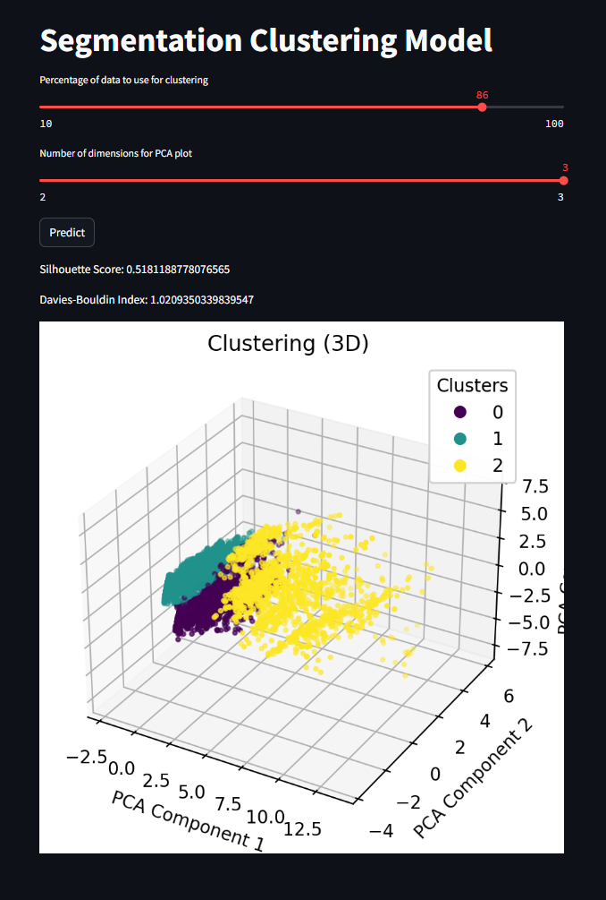

## Segementation Clustering Model<br><br>
[Model development](https://github.com/JeffM-Code/PortfolioWork/tree/main/ML/CustomerSegmentation)<br><br>
App<br><br>

The sliders change the % of data applied onto model, and the visual representation of the clustered data which can help give analytical depth to processed data.<br><br>

### Example:<br><br>
<br><br>

#### Model analysis:<br><br>
```
k = 3
kmeans = KMeans(n_clusters=k, random_state=42)

```
<br><br>

The number of clusters selected affects the mode's performance, as they directly influence the n_clusters model hyperparameter; too few clusters, model over-fits data, insufficiently capturing the inherent structure of the data, leading to poor predictive capability on new data, and conversely too many clusters lead to under-fitting, which leads poor capability to capture the underlying patterns and structure as the model will be too simplistic, making the model's performance on training and test data very poor as well.<br><br>


### Expected Model Performance:<br><br>

```
Silhouette Score: 0.24390746038884387
Davies-Bouldin Index: 1.5884676523144565

```
<br><br>

* Silhouette score above 0.5 is good, however with a score of 0.24 clusters data points may likely overlap each other.<br><br>
* The lower the Davies-Bouldin index (closest to 0), the better, but with a slightly high score of 1.58, there may be some poor cluster separation.